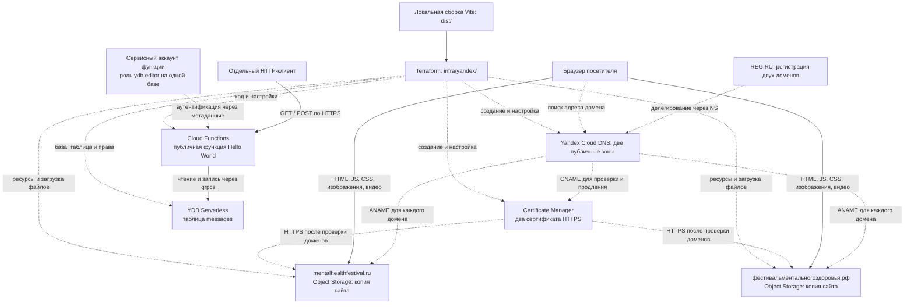

# Архитектура сайта и инфраструктуры

Сайт фестиваля — статическое приложение React и Vite. Сборка содержит HTML,
JavaScript, CSS, фотографии и видео. В Yandex Cloud размещены две одинаковые
копии сайта, отдельная публичная функция Hello World и серверная база YDB.
Администрирование использует отдельный VK-защищённый API и общую модель пользователей, ролей и профилей экспертов (см. ниже).
Все облачные ресурсы находятся в каталоге `b1g5fdg0o0t57rnfm9j4`.

## Схема

Сплошные стрелки показывают передачу файлов или запросов. Пунктирные —
настройку, разрешение DNS и права доступа. DNS сообщает браузеру адрес;
содержимое сайта через DNS не проходит.

## Домены и статический сайт

Оба домена открывают одну и ту же страницу; перенаправления между ними нет.
Регистрация и продление остаются в REG.RU, а записи DNS управляются в Yandex
Cloud. Делегирование использует `ns1.yandexcloud.net` и `ns2.yandexcloud.net`.

Для каждого домена создан отдельный бакет Object Storage с именем домена.
Кириллическое имя в конфигурации записано в Punycode:
`xn--80aaecegccue9ackpcqbca3bewh1b5qgk8f.xn--p1ai`.
Корневая запись ANAME указывает на `<имя-домена>.website.yandexcloud.net`.

Браузер получает `index.html`, затем загружает приложение, оформление и медиа
из того же бакета. Сборка для этих доменов использует `PAGES_BASE_PATH=/`.
Файлы доступны для публичного чтения; просмотр списка объектов и настроек
бакета публично отключён. Скрытые файлы, включая `.DS_Store`, не загружаются.

Кэширование задаётся Terraform: JS/CSS с хешем в имени — год с `immutable`,
изображения, видео и шрифты — 30 дней, остальные файлы (включая HTML) —
`no-cache` с проверкой актуальности. Vite рассчитывает версии файлов `public/`
по содержимому; общий `assetUrl` добавляет `?v=<hash>` к локальным ссылкам,
включая пути из API. При замене медиа нужна новая сборка и публикация:
новый URL обходит старый кэш. Внешние ссылки спонсоров остаются без изменений.
Версия в query не создаёт архивной копии файла; для медиа `immutable` не используется.

Провайдер Yandex 0.235.0 не поддерживает `cache_control` для объектов.
Ресурс `terraform_data.site_cache_headers` после загрузки вызывает локальный
Node.js-скрипт: HEAD, копирование объекта на себя с новым Cache-Control и
проверка результата. Скрипт сохраняет метаданные и проверяет ETag, используя
те же переменные авторизации, что и Terraform. Изменение файлов или скрипта
повторяет этот шаг. Это не непрерывная проверка drift: для восстановления
заголовков после ручного изменения нужно явно заменить этот ресурс.
Заголовки GitHub Pages этим Terraform не управляются.

Видео раздаются напрямую из Object Storage с поддержкой запросов диапазонов
байтов. API Gateway не создавался: его лимит ответа 2,5 МБ неудобен для
фонового видео сайта. Отдельного постоянно работающего сервера нет.

## HTTPS и состояние публикации

Для каждого домена запрошен собственный сертификат Certificate Manager.
Постоянная запись `_acme-challenge` типа CNAME подтверждает владение доменом
и нужна для последующего автоматического продления сертификата.

Публикация проходит в два этапа:

1. Terraform создаёт бакеты, DNS, запросы сертификатов, функцию и YDB.
2. После делегирования доменов и выдачи сертификатов `enable_https = true`
   подключает сертификаты к бакетам. Затем проверяются оба домена по HTTPS.

**Состояние на 5 октября 2026 года:** инфраструктура создана; пользователь
сообщил о сохранении новых NS в REG.RU. При последней проверке делегирование
ещё не было опубликовано, сертификаты имели статус `VALIDATING`, а
`enable_https` оставался `false`. Схема показывает целевую конфигурацию HTTPS;
готовность собственных доменов по HTTPS пока не подтверждена.

## Функция и база данных

Функция доступна отдельно по адресу:
<https://functions.yandexcloud.net/d4eggj7dcf05pjql58q6>.
Страница фестиваля не вызывает демонстрационную функцию; админка вызывает отдельный API. До входа через VK сайт не создаёт запросов к YDB; демонстрационный API можно вызывать независимо от сайта.

Функция работает на Python 3.12 и использует YDB SDK. В таблице `messages`
есть два поля: `id` (`Utf8`, первичный ключ, обязательное) и `message` (`Utf8`).

| Запрос | Действие | Результат |
| --- | --- | --- |
| GET | Читает запись с `id = hello` | `message: Hello world`, сохранённое значение и `written: false` |
| POST | Записывает `Hello world` в запись `hello`, затем читает её | Сохранённое значение и `written: true` |
| OPTIONS | Отвечает на предварительный запрос браузера | Параметры CORS, без обращения к базе |

Тело POST игнорируется: вызывающий не выбирает ключ или значение.
Повторные записи обновляют одну и ту же строку. Если строки ещё нет, GET
возвращает `stored_message: null`. Ошибка базы возвращается как HTTP 503
без раскрытия внутренней ошибки клиенту. Живая проверка GET → POST → GET
подтвердила запись и последующее чтение через YDB.

## Доступ, ограничения и управление

Публичная роль `serverless.functions.invoker` разрешает вызов функции без
авторизации. Сама функция обращается к YDB от имени собственного сервисного
аккаунта: его роль `ydb.editor` ограничена этой базой. База не открыта для
анонимных пользователей. Краткоживущие данные авторизации функция получает
через метаданные; соединение с YDB использует TLS (`grpcs://`).

CORS разрешает браузерные запросы с двух доменов по HTTPS. Это не способ
защитить публичный API от других HTTP-клиентов.

Для функции настроены 256 МБ памяти, таймаут 30 секунд, один запрос на
экземпляр, максимум один экземпляр и пять одновременных запросов на зону.
Для YDB заданы ограничение 10 RCU/с, отсутствие резервированной мощности
и лимит хранения 1 ГБ. Каждый бакет ограничен 1 ГиБ. Эти настройки не являются
общим бюджетом расходов. Бакеты и таблица защищены от удаления через Terraform,
а база и сертификаты — настройкой `deletion_protection`.

Terraform описывает ресурсы в [`infra/yandex/`](../infra/yandex/README.md).
Ключ авторизации, локальные переменные, планы, архив функции и состояние
Terraform исключены из Git. Состояние хранится локально: его нужно сохранять,
чтобы последующие изменения управляли уже созданными ресурсами.

Обновление сайта: собрать `dist/` для корня домена, проверить Terraform plan
и применить его. Контрольные суммы определяют изменившиеся файлы; старые
управляемые файлы, исчезнувшие из сборки, удаляются из бакетов.

GitHub Pages остаётся отдельным вариантом публикации. Workflow
`.github/workflows/pages.yml` обновляет только GitHub Pages и не публикует
изменения в Yandex Cloud. Автоматическая публикация в Yandex пока не настроена.

## Связанные документы и источники

- [AGENTS.md](../AGENTS.md) — правила работы с проектом.
- [Инструкция по Yandex Cloud](../infra/yandex/README.md) — команды развёртывания и проверки.
- [Снимок развёртывания](../infra/yandex/DEPLOYMENT.md) — идентификаторы и выполненные проверки.
- [GitHub Pages](github-pages.md) — независимый путь публикации.
- [Домены Object Storage](https://yandex.cloud/en/docs/storage/operations/hosting/own-domain).
- [HTTPS Object Storage](https://yandex.cloud/en/docs/storage/operations/hosting/certificate).
- [Ограничения API Gateway](https://yandex.cloud/en/docs/api-gateway/concepts/limits).

## Управление участниками и событиями

Администрирование открывается по `#admin` в той же статической сборке; серверный
API — отдельная функция `festival-admin`, исходники `infra/yandex/admin/`.
VK ID access token хранится в памяти браузера и отправляется в `X-VK-Token`. Стандартный `Authorization` зарезервирован
платформой Cloud Functions для IAM и не используется для токенов VK.
Каждый запрос проверяет токен через VK ID `user_info` для приложения 54800266.
Роль читается из YDB в той же SerializableReadWrite-транзакции, что и изменение.
Скрытая ссылка в меню не является защитой: API самостоятельно запрещает доступ.

- `Users`: внутренний стабильный `id` Utf8 (PK), необязательный VK ID Int64, имя и приватная заметка.
- `VkIdentities`: VK ID Int64 (PK) → внутренний пользователь; обеспечивает уникальность привязки в транзакции.
- `UserRoles`: составной PK (`user_id`, `role`), роли `attendee` и `admin` могут совмещаться.
- `ExpertProfiles`: `user_id` (PK), фотография, публичная ссылка, профессия, описание и порядок. Наличие профиля означает статус эксперта.
- `Events`: стабильные ID `program-01` … `program-15`, название и описание (`text` программы → `description`); `program_id` сохраняет числовой ID из JSON, `sort_order` — порядок событий. Поля `category`, `tag`, `location`, `access`, `background` сохраняют остальные сведения программы. `time_start` и `time_end` имеют тип Timestamp: дата 10 октября 2026 года, исходное время Europe/Moscow переводится в UTC. Для закрытия в 18:30 `time_end` равен NULL; прежняя колонка `time` удалена. Новые поля nullable для совместимости с существующей админкой.
- `AttendanceV2` и `HostsV2`: PK (`user_id`, `event_id`); посещаемость требует роли участника, ведущий — профиля эксперта.

В ответе `list` массив `attendance` содержит только записи пользователя,
определённого по проверенному VK-токену и актуальной привязке в `VkIdentities`.
Каждая запись содержит только `event_id`, без `user_id`. Без связанного
пользователя возвращается пустой массив. Правило действует и для администратора
на основной странице. Админка использует отдельное действие `adminList` той же
функции: оно требует проверенного VK-токена и роли `admin` и возвращает все
посещения с `user_id` и `event_id`. Общая логика чтения остальных таблиц используется
обоими действиями. `adminList` доступен и при приостановленных изменениях.

YDB не обеспечивает внешние ключи: API проверяет связи и выполняет изменения вместе с авторизацией в SerializableReadWrite-транзакции. VK ID передаются строками в JSON. Администратору требуется VK-привязка; самоудаление, снятие собственной роли и удаление последнего администратора запрещены. Вход не создаёт пользователей и не назначает роли.

5 октября 2026 года выполнен согласованный cutover: старые `Participants`, `Attendance`, `Hosts` сохранены только для rollback; новый API их не меняет. Импортированы 15 пользователей, 2 VK-привязки, 4 роли, 13 профилей и 1 связь посещения; Events сохранены. Подробности и ограничения проверки — в `infra/yandex/DEPLOYMENT.md` и [операторской инструкции](identity-migration/operations.md).

Полная программа импортируется в `Events`, а массивы `people` — в связи `HostsV2` по точному совпадению с `Users.id`; импорт проверяет наличие профиля эксперта. Скрипт `infra/yandex/migrate-program.py` сохраняет резервную копию, добавляет колонки без пересоздания таблицы и проверяет данные транзакционно. Двухколоночная `HostsV2` хранит состав ведущих без порядка. Публичная страница пока продолжает читать `src/program.json`, который сохраняет порядок ведущих; изменение базы само по себе не обновляет статическую страницу. `src/experts.json` — публичный экспорт из YDB; браузер читает его из статической сборки. Экспорт не содержит VK ID, приватные заметки, роли или посещаемость. Редактирование профиля в админке становится публичным после экспорта, сборки и публикации; [процедура](public-expert-export.md). Татьяна Хотеева исключена из seed и публичного снимка.

## Динамические спонсоры

`Sponsors` — отдельная таблица (`id`, `name`, `image`, `link`: Utf8; `display`: Bool).
`id` — обязательный первичный ключ; все поля обязательные, пустые имя и ссылка
хранятся как пустые строки. Terraform описывает таблицу в `sponsors.tf` и создаёт её
до обновления `festival-admin`. Действие `list` читает только `display = true`
и добавляет массив `sponsors` в общий ответ. `DataProvider` загружает его вместе
с остальными данными, а раздел `#sponsors` отображает динамическую галерею.
Имя, ссылка и видимость меняются без пересборки сайта; изображения могут иметь
существующий локальный путь или внешний HTTP/HTTPS URL.
Начальный импорт — `seed-sponsors.py`, все файлы `public/logos/`, автоматически
созданные UUID, пустые имена и ссылки, `display = true`.
[Инструкция редактирования и импорта](editing-sponsors.md).
